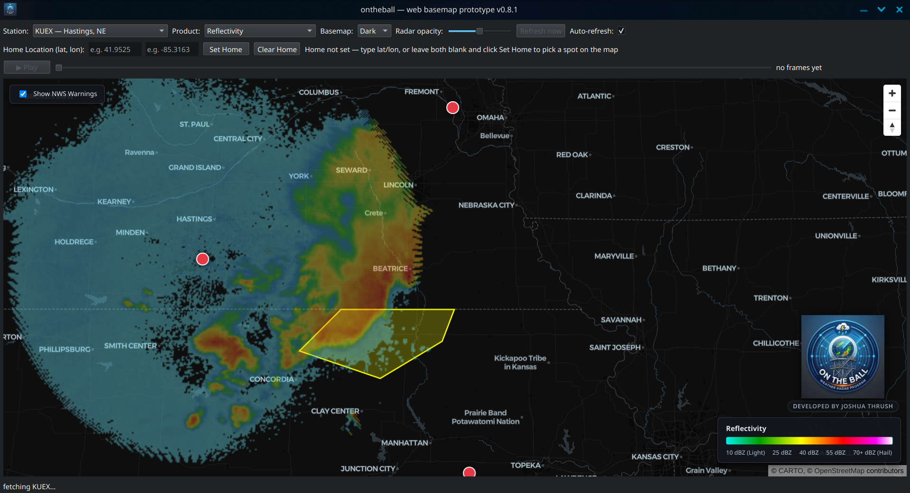

# ontheball — web basemap prototype (v0.10.8)



A Linux-native, GR2Analyst-style live NEXRAD radar viewer — Reflectivity,
Base Velocity, Correlation Coefficient, and Differential Reflectivity (ZDR),
pulled straight from NOAA/Unidata's free public archive, rendered onto a
real interactive map (pan/zoom, station click-to-swap, NWS warning
polygons). No Windows, no paid license, no API key.

**Trying it out for the first time?** See [Install](#install-one-time) and
[Run](#run) below — or just run `./install.sh` once and `./run.sh` each
time after. Found a bug or something doesn't render right for your
station? Open a GitHub issue — that kind of report is exactly what's
useful at this stage.

## Install (one-time)

Using a virtual environment keeps these dependencies isolated from your
system Python — recommended so installs stay clean across versions:

```bash
cd ontheball_web          # your cloned repo folder

# One-time per machine: make sure the venv module is available
sudo apt-get install -y python3-venv

# Create and activate a virtual environment (per project folder)
python3 -m venv .venv
source .venv/bin/activate
# your prompt should now show (.venv) at the front

# Install everything the app needs — inside a venv, no --break-system-packages needed
pip install --upgrade pip
pip install -r requirements.txt
```

If PyQt6 complains about a missing xcb-cursor plugin on a fresh system,
that's a system package, not a Python one — install it outside the venv:

```bash
sudo apt-get install -y libxcb-cursor0
```

The `assets/` folder already contains a local copy of MapLibre GL JS
(`maplibre-gl.mjs`, `-shared.mjs`, `-worker.mjs`, `.css`) pulled via npm,
so there's no npm/node dependency at runtime — only pip.

When you're done testing: `deactivate`. Next time, just
`source .venv/bin/activate` again in that same folder — no reinstall
needed unless you're on a new version/folder.

## Run

```bash
cd ontheball_web
source .venv/bin/activate   # if not already active
python3 ontheball_web.py
```

A window opens with a Station picker, a Product dropdown (Reflectivity,
Base Velocity, Correlation Coefficient, ZDR), a Basemap toggle, a radar
opacity slider, "Refresh now", and an auto-refresh checkbox. It fetches
the latest volume for the selected station from
`s3://unidata-nexrad-level2` (free, anonymous), decodes + clutter-filters
it with Py-ART, grids it, and renders it onto the map as a semi-transparent
overlay — hovering the map shows the real value under the cursor
highlighted on the legend. Enter a Home Location (or click the map) to
load and track the 3 closest stations automatically. The basemap itself
is loaded live from OpenFreeMap (`tiles.openfreemap.org`) — needs your
normal internet access, no API key.

<!--
MAINTENANCE NOTE: Install (one-time) and Run stay as the first two
sections of this file, immediately after the title — always add new
content below them, never above. Keep this comment when editing.

Version-by-version "What's new" entries go in CHANGELOG.md, not here —
this file stays a stable pitch + getting-started doc. Add a new entry
to the top of CHANGELOG.md instead.
-->

**Versioning note**: this project now lives in git
(github.com/FreshWound/ontheball_web) — the old zip-per-version workflow
is superseded by real commit history. `git log` shows every past state,
and `git checkout <commit>` (or a tag, once any are cut) gets you back
to a specific one if a change ever needs rolling back. The `__version__`
string in `ontheball_web.py` and the version in this title still get
bumped each notable change, just as a quick human-readable marker
alongside the commit history — not as the primary safety net anymore.

## Changelog

Version-by-version history of what changed and why lives in
[CHANGELOG.md](CHANGELOG.md).
